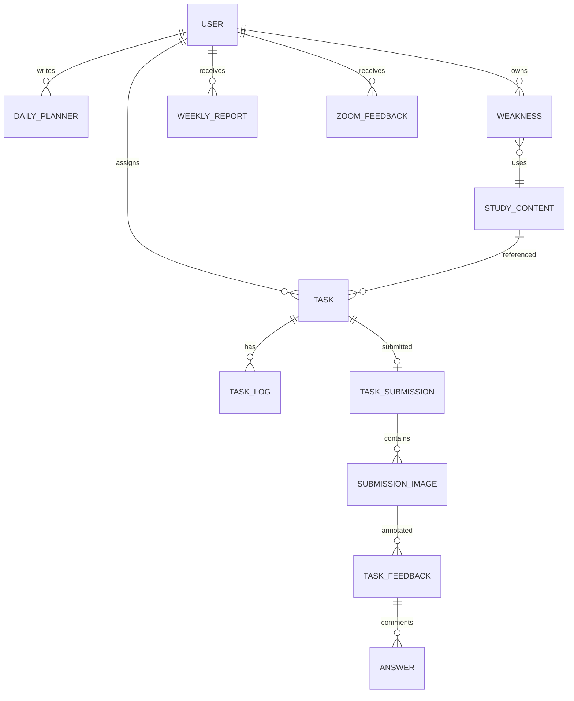
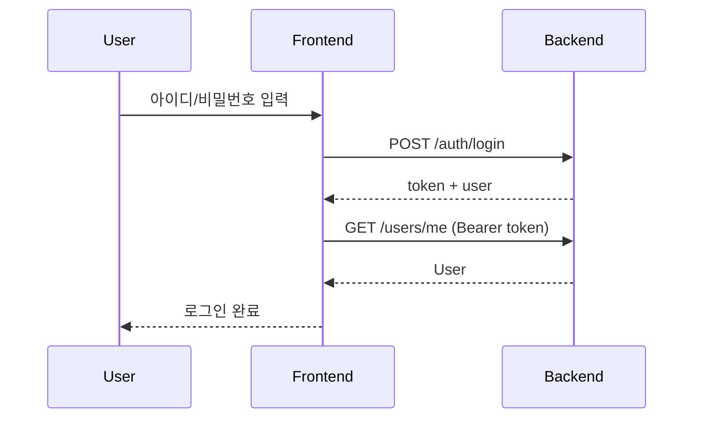
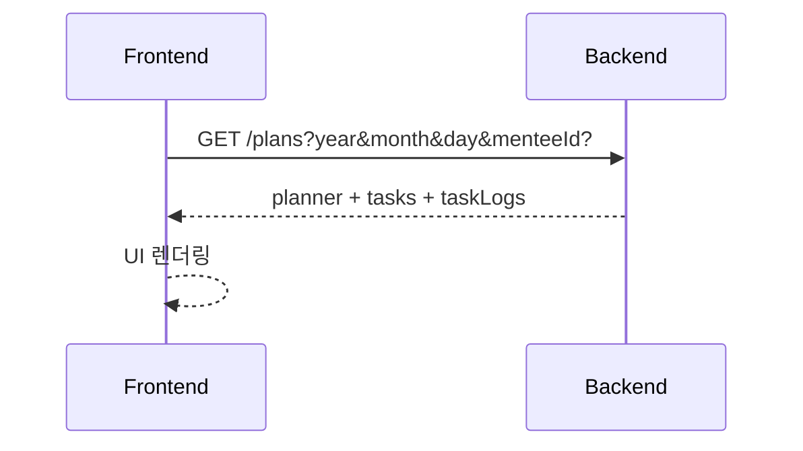
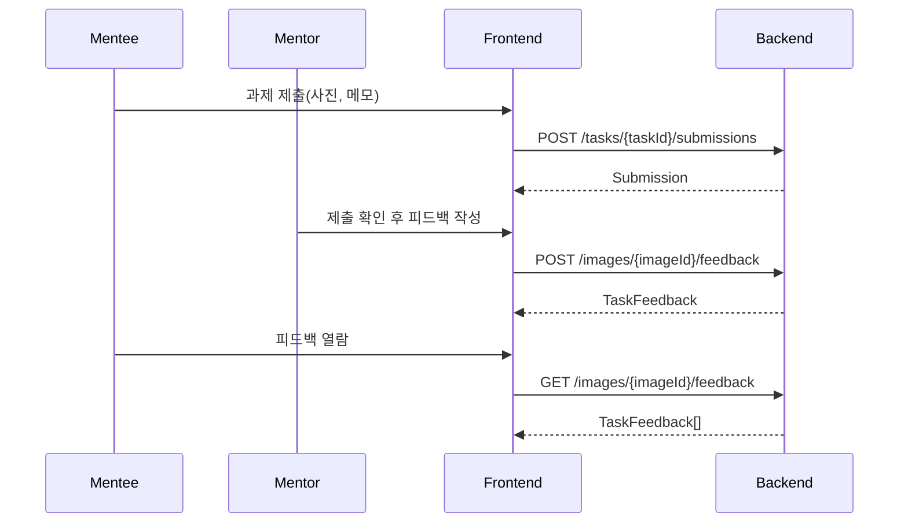
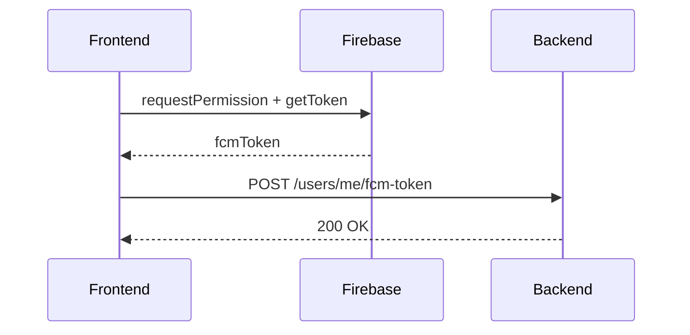

# Technical Specification — 설스터디

## 1. 프로젝트 개요
설스터디는 자체 학습지 기반으로 수능 국·영·수 학습 코칭을 제공하는 플랫폼이다. 기존 노션 기반 운영의 불편함을 해소하고, 멘티에게는 모바일 최적화 학습 환경을, 멘토에게는 효율적인 과제·피드백 관리 도구를 제공한다.

주요 타겟:
- 수능을 준비하는 고등학교 2~3학년 학생

운영 구조:
- 멘토 1명이 다수의 멘티를 관리

플랫폼 환경:
- 멘토: 웹(PC)
- 멘티: 웹앱(모바일)

## 2. 목표 및 스코프
포함 사항:
- 사전 생성된 멘토·멘티 계정 기반 로그인/권한 분리
- 멘티 플래너, 과제 수행(자료 다운로드/사진 업로드), 피드백 열람, 캘린더, 마이페이지
- 멘토 대시보드, 과제 등록, 피드백 작성, 과거 피드백 소급 업로드
- 알림 및 FCM 푸시 수신
- 주간 리포트, 약점(보완점) 관리, Zoom 피드백 기록

제외 사항:
- 공개 회원가입/온보딩
- 결제/구독
- 실시간 화상/채팅
- 관리자 콘솔

## 3. 기술 스택 (Tech Stack)
| 영역 | 스택 | 버전/비고 |
|---|---|---|
| Framework | React + Vite | React 19.2.0, Vite 7.2.4, SPA |
| Language | TypeScript | 5.9.3, Strict Mode |
| Styling | Chakra UI + Emotion | Chakra UI 2.10.9, Emotion 11.14.x |
| State | Zustand | 5.0.11, persist(localStorage) |
| Routing | react-router-dom | 7.13.0 |
| API | Axios | 1.13.5 |
| Push | Firebase FCM | 12.9.0, Service Worker 사용 |
| PDF | react-pdf, @react-pdf-viewer | pdfjs-dist 포함 |
| Deploy | TBD | 리포지토리 내 배포 설정 없음 |

## 4. 시스템 아키텍처
```mermaid
graph TD
    ClientMentee[Mentee WebApp (Mobile)] -->|HTTPS + JWT| API[Backend API]
    ClientMentor[Mentor Web (PC)] -->|HTTPS + JWT| API
    API --> DB[(RDBMS)]
    API --> Storage[(File/Object Storage)]
    API --> FCM[Firebase Cloud Messaging]
    ClientMentee --> FCM
    ClientMentor --> FCM
```

## 5. 프로젝트 디렉터리 구조 (FSD)
```text
src/
├── app/                          # App Layer
├── assets/
├── pages/                        # Pages Layer
│   ├── login/
│   ├── mentee/
│   │   ├── calendar/ feedback/ mypage/ notifications/ planner/ report/ task/
│   └── mentor/
│       ├── dashboard/ feedback/ mentee/ mypage/ task/
├── widgets/                      # Widgets Layer
│   ├── calendar/ feedback/ main-layout/ mentee-profile/
│   ├── mentor/ mentor-planner/ mentor-report/ mentor-weakness/ mentor-zoom/
│   ├── notifications/ planner/ task-detail/
├── features/                     # Features Layer
│   ├── auth/ feedback/ mentee-dashboard/ mentor-dashboard/
│   ├── mentoring/ notification/ planner/ report/
│   ├── study-content/ study-time/ task/ task-feedback/ task-submission/
│   ├── timer/ user/ weakness/ zoom-feedback/
├── entities/                     # Entities Layer
│   ├── answer/ daily-plan/ feedback/ mentee-info/ notification/
│   ├── question/ study-content/ study-time/ submission/ submission-image/
│   ├── task/ task-detail/ task-feedback/ task-log/ task-submission/
│   ├── user/ weakness/ weekly-report/ zoom-feedback/
├── shared/                       # Shared Layer
│   ├── api/ constants/ hooks/ lib/ stores/ types/ ui/
└── __archived__/
```

## 6. 데이터 흐름 및 상태 관리
데이터 흐름:
- Read: Page → Widget → Feature(Hook) → API/Store → UI
- Write: User Action → Feature(Hook) → API Call → Store Update → UI Re-render

상태 관리:
- Global: Zustand(`authStore`, `plannerStore` 등) + persist(localStorage)
- Local: React `useState`
- Server State: Axios 호출 기반, 필요 시 React Query 도입 가능

API 통신:
- `apiClient`: JWT 자동 주입, 공통 오류 처리
- `rawClient`: 로그인 토큰 추출용
- 응답 포맷: 래핑 응답(`{ success, data, error }`) 또는 Raw DTO 모두 허용

## 7. API 명세 (상세 표)
공통 규약:
- Base URL: `VITE_API_URL`
- Auth: `Authorization: Bearer <JWT>`
- 파일 업로드: `multipart/form-data`

### 7.1 Auth / User
| Method | Path | Query | Body | Response | Notes |
|---|---|---|---|---|---|
| POST | /auth/login | - | `{ username, password }` | `{ user, token }` | 토큰은 헤더/바디 모두 허용 |
| GET | /users/me | - | - | `User` | 로그인 사용자 조회 |
| PATCH | /users/me | - | `{ name?, nickName? }` | `User` | 서버 필드명 `nickname` 지원 |
| PATCH | /users/me/profile | - | `file` | `profileUrl` | 프로필 이미지 업로드 |
| POST | /users/me/fcm-token | - | `{ fcmToken }` | void | FCM 토큰 등록 |

### 7.2 Mentoring / Dashboard
| Method | Path | Query | Body | Response | Notes |
|---|---|---|---|---|---|
| GET | /mentor/mentees | `page?, size?` | - | `MenteeNavItem[]` | 멘토 담당 멘티 목록 |
| GET | /mentor/{menteeId} | `type=WEEK|MONTH` | - | `MenteeProfileData` | 멘토 관점 멘티 대시보드 |
| GET | /mentee/me | `type=WEEK|MONTH` | - | `MenteeProfileData` | 멘티 본인 대시보드 |

특이사항:
- `/mentor/dashboard` 전용 API 없음. 클라이언트에서 멘티 목록 + 알림 + 멘티 대시보드를 조합해 구성.

### 7.3 Planner
| Method | Path | Query | Body | Response | Notes |
|---|---|---|---|---|---|
| GET | /plans | `year, month, day, menteeId?` | - | `{ planner, tasks, taskLogs, totalStudyTime }` | 일일 플래너 조회 |
| POST | /plans | - | `{ planDate, dailyMemo }` | `DailyPlanner` | 플래너 생성 |
| PUT | /plans/{planId} | - | `{ dailyMemo }` | `DailyPlanner` | 플래너 수정 |
| GET | /plans/calendar | `menteeId?, year, month, subject?, incompleteOnly?, page?, size?` | - | `CalendarTaskData[]` | 월간 캘린더 |
| GET | /plans/calendar/weekly | `menteeId?, date, page?, size?` | - | `CalendarTaskData[]` | 주간 캘린더 |
| GET | /plans/{planId}/feedback | - | - | `PlanFeedback?` | 플래너 피드백 조회 |
| POST | /plans/{planId}/feedback | - | `{ content }` | `PlanFeedback` | 플래너 피드백 생성 |
| PUT | /plans/{planId}/feedback | - | `{ content }` | `PlanFeedback` | 플래너 피드백 수정 |
| DELETE | /plans/{planId}/feedback | - | - | void | 플래너 피드백 삭제 |

### 7.4 Task / Submission / Timer
| Method | Path | Query | Body | Response | Notes |
|---|---|---|---|---|---|
| GET | /tasks/{taskId} | - | - | `TaskDetailFullData` | 과제 상세 |
| GET | /tasks/{taskId}/submissions | - | - | Submission DTO | 과제 제출 조회 |
| POST | /tasks | - | `{ date, title, subject }` | `Task` | 멘티 과제 생성 |
| PUT | /tasks/{taskId} | - | `{ title?, subject?, status? }` | `Task` | 과제 수정 |
| DELETE | /tasks/{taskId} | - | - | void | 과제 삭제 |
| POST | /tasks/{menteeId} | - | `주간 과제 생성 DTO` | void | 멘토 과제 등록 |
| PATCH | /mentor/tasks/{taskId}/confirm | - | - | void | 멘토 확인 |
| PATCH | /tasks/{taskId}/timer/start | - | - | Timer DTO | 학습 타이머 시작 |
| PATCH | /tasks/{taskId}/timer/stop | - | - | Timer DTO | 학습 타이머 종료 |
| GET | /tasks/{taskId}/logs | - | - | `TaskLog[]` | 학습 로그 |
| POST | /tasks/{taskId}/submissions | - | `files[], comment` | Submission DTO | 제출 업로드 |
| DELETE | /tasks/submissions/{submissionId} | - | - | void | 제출 삭제 |

### 7.5 Feedback / Comment
| Method | Path | Query | Body | Response | Notes |
|---|---|---|---|---|---|
| GET | /images/{imageId}/feedback | - | - | `TaskFeedback[]` | 이미지 코멘트 피드백 |
| POST | /images/{imageId}/feedback | - | `content, xPos, yPos, file?` | `TaskFeedback` | 좌표는 0~1 정규화 |
| PUT | /feedback/{feedbackId} | - | `content?, imageUrl?, xPos?, yPos?` | `TaskFeedback` | 피드백 수정 |
| DELETE | /feedback/{feedbackId} | - | - | void | 피드백 삭제 |
| GET | /feedback/{feedbackId}/comments | - | - | `Answer[]` | 댓글 조회 |
| POST | /feedback/{feedbackId}/comments | - | `{ comment }` | `Answer` | 댓글 작성 |
| PUT | /feedback/comments/{commentId} | - | `{ comment }` | `Answer` | 댓글 수정 |
| DELETE | /feedback/comments/{commentId} | - | - | void | 댓글 삭제 |
| GET | /feedbacks/yesterday | - | - | `FeedbackWithTask[]` | 전일 피드백 목록 |
| GET | /feedbacks/history | `menteeId, year?, month?, weekNumber?, subject?, startDate?, endDate?` | - | `FeedbackWithTask[]` | 피드백 히스토리 |

### 7.6 Weakness / Study Content
| Method | Path | Query | Body | Response | Notes |
|---|---|---|---|---|---|
| GET | /mentor/weakness/{menteeId} | - | - | `Weakness[]` | 멘토 관점 약점 목록 |
| GET | /mentee/weakness/me | - | - | `Weakness[]` | 멘티 본인 약점 목록 |
| POST | /mentor/weakness | - | `{ menteeId, subject, title, contentId? }` | `Weakness` | 약점 생성 |
| DELETE | /mentor/weakness/{weaknessId} | - | - | void | 약점 삭제 |
| POST | /study-contents | - | `file, title?, subject?` | `StudyContent` | 학습지 업로드 |

### 7.7 Weekly Report
| Method | Path | Query | Body | Response | Notes |
|---|---|---|---|---|---|
| GET | /weekly-reports | `year, month, menteeId?` | - | `WeeklyReport[]` | 주간 리포트 목록 |
| GET | /weekly-reports/{reportId} | - | - | `WeeklyReport` | 리포트 상세 |
| POST | /mentor/weekly-report | - | 리포트 DTO | `WeeklyReport` | 생성 |
| PATCH | /mentor/weekly-report/{reportId} | - | 리포트 DTO | `WeeklyReport` | 수정 |
| DELETE | /mentor/weekly-report/{reportId} | - | - | void | 삭제 |

### 7.8 Zoom Feedback
| Method | Path | Query | Body | Response | Notes |
|---|---|---|---|---|---|
| GET | /mentor/list/{menteeId} | - | - | `ZoomFeedbackListItem[]` | 멘토 목록 |
| GET | /mentee/list | - | - | `ZoomFeedbackListItem[]` | 멘티 목록 |
| GET | /mentor/zoom-feedback/{zoomId} | - | - | `ZoomFeedbackData` | 멘토 상세 |
| GET | /mentee/zoom-feedback/{zoomId} | - | - | `ZoomFeedbackData` | 멘티 상세 |
| POST | /mentor/zoom-feedback/{menteeId} | - | `ZoomFeedbackData` | `ZoomFeedbackData` | 생성 |
| PUT | /zoom-feedback/{zoomId} | - | `ZoomFeedbackData` | `ZoomFeedbackData` | 수정 |
| DELETE | /mentor/zoom-feedback/{zoomId} | - | - | void | 삭제 |

### 7.9 Notification
| Method | Path | Query | Body | Response | Notes |
|---|---|---|---|---|---|
| GET | /notifications | `filter=all|unread|read, page, size` | - | `NotificationPage` | 알림 목록 |
| PATCH | /notifications/{notificationId}/read | - | - | void | 단건 읽음 처리 |
| PATCH | /notifications/read-all | - | - | void | 전체 읽음 처리 |

## 8. 데이터 모델 (요약)
열거형:
- `UserRole`: `MENTOR`, `MENTEE`, `WITH_DRAW`
- `Subject`: `KOREAN`, `ENGLISH`, `MATH`, `OTHER`
- `TaskStatus`: `TODO`, `IN_PROGRESS`, `DONE`
- `NotificationType`: `REMINDER`, `FEEDBACK`, `SUBMISSION`, `COMMENT`, `TASK`, `PLAN_FEEDBACK`, `WEEKLY_REPORT`, `ZOOM_FEEDBACK`

### User
| Field | Type | Notes |
|---|---|---|
| id | string | 사용자 ID |
| username | string | 로그인 아이디 |
| name | string | 이름 |
| nickName | string | 닉네임 |
| role | UserRole | 권한 |
| profileImgUrl | string|null | 프로필 이미지 |
| fcmToken | string? | FCM 토큰 |
| isAlarmEnabled | boolean | 알림 허용 |

### Task
| Field | Type | Notes |
|---|---|---|
| id | string | 과제 ID |
| subject | Subject | 과목 |
| title | string | 제목 |
| status | TaskStatus | 상태 |
| taskDate | string | 과제 날짜 |
| isMentorChecked | boolean | 멘토 확인 |
| isMandatory | boolean | 필수 여부 |
| contentId | string|null | 학습지 연결 |
| weaknessId | string|null | 약점 연결 |
| menteeId | string | 멘티 ID |

### DailyPlanner
| Field | Type | Notes |
|---|---|---|
| id | string | 플래너 ID |
| planDate | string | 날짜 |
| totalStudyTime | number | 총 공부 시간 |
| dailyMemo | string|null | 멘티 메모 |
| mentorFeedback | string|null | 멘토 피드백 |
| menteeId | string | 멘티 ID |

### TaskFeedback / Answer
| Field | Type | Notes |
|---|---|---|
| TaskFeedback.id | string | 피드백 ID |
| TaskFeedback.content | string | 피드백 내용 |
| TaskFeedback.imageId | string | 이미지 ID |
| TaskFeedback.xPos/yPos | number | 좌표(0~1) |
| Answer.comment | string | 댓글 |
| Answer.feedbackId | string | 피드백 ID |

## 9. ERD


## 10. 주요 플로우 (Sequence)
### 10.1 로그인


### 10.2 멘티 일일 플래너 조회


### 10.3 과제 제출 → 피드백 → 확인


### 10.4 FCM 등록


## 11. 보안 및 성능 고려사항
- JWT 기반 인증, 만료 시 자동 로그아웃
- 역할 기반 접근 제어(멘토/멘티 분리)
- 파일 업로드 확장자/용량 검증 필요
- 페이징 기반 리스트 API 사용
- 대시보드 집계 API 부재로 클라이언트 조합 비용 발생

## 12. 테스트 및 배포 전략
- 단위 테스트: DTO 매핑, 스토어 로직
- 통합 테스트: 로그인, 플래너 조회, 과제/피드백 플로우
- E2E 테스트: 멘티 제출 → 멘토 피드백 → 멘티 확인
- 배포: Vite build 산출물 정적 배포, 환경변수 분리
- Service Worker: `firebase-messaging-sw.js` 배포 경로 검증

## 13. 환경 변수
| Key | 설명 |
|---|---|
| VITE_API_URL | Backend Base URL |
| VITE_FIREBASE_API_KEY | Firebase API Key |
| VITE_FIREBASE_AUTH_DOMAIN | Firebase Auth Domain |
| VITE_FIREBASE_PROJECT_ID | Firebase Project ID |
| VITE_FIREBASE_STORAGE_BUCKET | Firebase Storage Bucket |
| VITE_FIREBASE_MESSAGING_SENDER_ID | Firebase Sender ID |
| VITE_FIREBASE_APP_ID | Firebase App ID |
| VITE_FIREBASE_MEASUREMENT_ID | Firebase Measurement ID |
| VITE_FIREBASE_VAPID_KEY | FCM VAPID Key |
